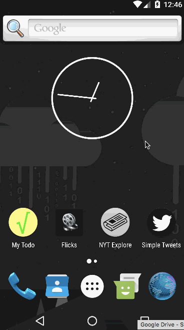

# Project 4 - *Simple Tweets*

**Simple Tweets** is an Android app that allows a user to view home and mentions timelines, view user profiles with user timelines, as well as compose and post a new tweet. The app utilizes [Twitter REST API](https://dev.twitter.com/rest/public).

Time spent: **18** hours spent in total

## User Stories

The following **required** functionality is completed:

* [x] The app includes **all required user stories** from Week 3 Twitter Client
* [x] User can **switch between Timeline and Mention views using tabs**
  * [x] User can view their home timeline tweets.
  * [x] User can view the recent mentions of their username.
* [x] User can navigate to **view their own profile**
  * [x] User can see picture, tagline, # of followers, # of following, and tweets on their profile.
* [x] User can **click on the profile image** in any tweet to see **another user's** profile.
 * [x] User can see picture, tagline, # of followers, # of following, and tweets of clicked user.
 * [x] Profile view includes that user's timeline
* [x] User can [infinitely paginate](http://guides.codepath.com/android/Endless-Scrolling-with-AdapterViews-and-RecyclerView) any of these timelines (home, mentions, user) by scrolling to the bottom

The following **optional** features are implemented:

* [ ] User can view following / followers list through the profile
* [x] Implements robust error handling, [check if internet is available](http://guides.codepath.com/android/Sending-and-Managing-Network-Requests#checking-for-network-connectivity), handle error cases, network failures
* [x] When a network request is sent, user sees an [indeterminate progress indicator](http://guides.codepath.com/android/Handling-ProgressBars#progress-within-actionbar)
* [ ] User can **"reply" to any tweet on their home timeline**
  * [ ] The user that wrote the original tweet is automatically "@" replied in compose
* [ ] User can click on a tweet to be **taken to a "detail view"** of that tweet
 * [ ] User can take favorite (and unfavorite) or retweet actions on a tweet
* [x] Improve the user interface and theme the app to feel twitter branded
* [ ] User can **search for tweets matching a particular query** and see results
* [ ] Usernames and hashtags are styled and clickable within tweets [using clickable spans](http://guides.codepath.com/android/Working-with-the-TextView#creating-clickable-styled-spans)

The following **bonus** features are implemented:

* [ ] Use Parcelable instead of Serializable using the popular [Parceler library](http://guides.codepath.com/android/Using-Parceler).
* [x] Leverages the [data binding support module](http://guides.codepath.com/android/Applying-Data-Binding-for-Views) to bind data into layout templates.
* [ ] On the profile screen, leverage the [CoordinatorLayout](http://guides.codepath.com/android/Handling-Scrolls-with-CoordinatorLayout#responding-to-scroll-events) to [apply scrolling behavior](https://hackmd.io/s/SJyDOCgU) as the user scrolls through the profile timeline.
* [ ] User can view their direct messages (or send new ones)

The following **additional** features are implemented:

* [x] Tweets of different timelines are saved in the database independently of each other, so that when the app is started in offline mode, each timeline can be independently restored from the data cached in the database
* [x] Use of a *login manager* and an *offline mode manager* in order to pull this business-level logic out of the low-level implementation

## Video Walkthrough

Here's a walkthrough of implemented user stories:

GIF created with [LiceCap](http://www.cockos.com/licecap/).

## Notes

- Abstraction of the timeline fragments can be improved: there is still a lot of replicated code in the different concrete subclasses.
- The manager approach (i.e. pulling business logic out of the low-level implementation) seems to be very powerful, but it's not trivial for novices how to best use it.
- Currently, identical tweets belonging to different timelines (e.g. home and user timeline) are saved independently of each other in the database. This should be improved to save each tweet only once.
- The "last update" timestamp of the user timelines is currently not specific to the corresponding user, but there's only a single timestamp for all user timelines. This could be fixed by storing the last update of each user timeline in an additional database table.

## Open-source libraries used

- [Codepath OAuth Handler](https://github.com/codepath/android-oauth-handler) - Android library for simplifying the handling of OAuth requests (uses ScribeJava and Android Async HTTP)
- [ScribeJava](https://github.com/scribejava/scribejava) - Simple OAuth client Java library
- [Android Async HTTP](https://github.com/loopj/android-async-http) - Simple asynchronous HTTP requests with JSON parsing
- [Gson](https://github.com/google/gson) - Java serialization/deserialization library for converting JSON objects to Java objects and vice versa
- [Picasso](http://square.github.io/picasso/) - Image loading and caching library for Android
- [DBFlow](https://github.com/Raizlabs/DBFlow) - Object-relational mapper (ORM) for Android
- [Retrolambda](https://github.com/evant/gradle-retrolambda) - Enable lambda expressions and method references for Java < 8
- [Stetho](http://facebook.github.io/stetho/) - Chrome-based Android debugging bridge (used for inspecting SQLite database)
- [EventBus](http://greenrobot.org/eventbus/) - Pass events between Android application components

## License

    Copyright 2017 Daniel Weibel

    Licensed under the Apache License, Version 2.0 (the "License");
    you may not use this file except in compliance with the License.
    You may obtain a copy of the License at

        http://www.apache.org/licenses/LICENSE-2.0

    Unless required by applicable law or agreed to in writing, software
    distributed under the License is distributed on an "AS IS" BASIS,
    WITHOUT WARRANTIES OR CONDITIONS OF ANY KIND, either express or implied.
    See the License for the specific language governing permissions and
    limitations under the License.
